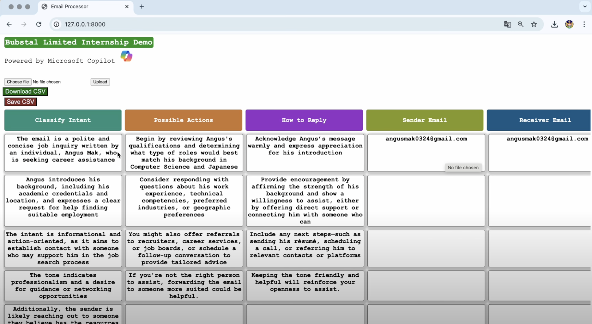

# Bubstal Internship Demo (by Wai Lun Mak)

## Video Demo:

### How to Run:
1. Please cd into "bubstal" folder.
2. python3 manage.py runserver

**(Note: Please do not touch your computer when Django is processing the .eml file.)**

### Architecture:
- Email Upload 
- AI: Microsoft Copilot 
- UI: Django
- Database: MySQL 

### Process: 
**a.** Django handles the incoming .eml file uploaded by the user.  
**b.** Django uses Selenium to open a new page linked to Copilot in the background.  
**c.** Selenium asks Copilot the necessary questions.  
**d.** Copilot generates a CSV file and Selenium webscrapes it.  
**e.** When finished, the generated CSV file is displayed as a Kanban view.  
**f.** The user has the option to store the generated CSV in a SQL database.  
**g.** The user can delete the stored CSV files anytime.  

### Happy Points:
✅ The "Download Now" button loads the immediately generated CSV file perfectly.  
✅ The "Save CSV" button works. The user can revisit and download the saved CSV files anytime.  

### Improvements:
1. The UX/UI can be improved. 
2. The saved CSV files are sometimes formatted incorrectly. 
3. The user CANNOT touch their computer while the .eml file is being processed. 

### Thoughts:
1. I had very limited time today due to unforeseen reasons but I'm glad that I managed to complete the web application in more than 5 hours. 
2. I choose Selenium to webscrape and ask the chatbot questions because it is one of the most efficient plugins that help with automatic browser navigation. 
3. I choose Copilot because it is available in Hong Kong. I planned to use Gemini at first, but sadly it is not available in the city. 
4. I choose Django because of its built-in SQL database that is easy to store models with (which in this case are the CSV files).

## AI Logic:
1. I asked the Copilot AI to reply with a CSV file.
2. I asked the Copilot AI to divide its answer into 6 sections: Classify Action, Possible Actions, How to Reply, Sender's Email, Sender's Name, Receiver's Email
3. I requested that the CSV file must have 6 rows responding to those 6 types of sections.
4. Whenever Copilot generates a CSV file with 6 rows, Selenium will webscrape the answer and let Django handle its display UI.  
